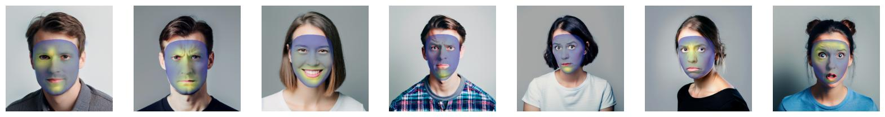

# face-projection



Are you looking for a powerful, user-friendly tool to project information onto faces while maintaining their natural structure?
Look no further – `face-projection` is here to simplify how you visualize facial data.
The tool is open-source, easy to use, and written in Python, allowing you to easily integrate it into your existing workflow.
We try to keep the dependencies to a minimum so you can use them in your projects without worrying about compatibility issues.
However, we do not guarantee perfect anatomical correctness of the results but try to keep the distortion to a minimum.

All people shown here in the repository examples were generated with `StableDiffusion` (Prompt: `A professional portrait photo of a person directly looking <emotion> at the camera, white background, photoshop, Instagram`)

## Installation

The tool is available on [PyPI](https://pypi.org/project/face-projection/).

```bash
pip install face-projection
```

## Usage

The tool reduces the overhead of projecting information onto faces to a minimum.
Load the data and face, project it, and you are done.
You must only ensure the data is inside the canonical face model (see [electromyogram](https://github.com/cvjena/electromyogram) for an example).
The head pose can be arbitrary, but the face must be visible.

```python
import face_projection as fp
from PIL import Image

image_face = np.asarray(Image.open("face.jpg").convert("RGB"))
image_data = np.asarray(Image.open("data.jpg").convert("RGB"))

warper = fp.Warper()
warped = warper.apply(image_face, image_data, beta=0.2)
```

We automatically detect the face in the image, compute the landmarks based on the `Blaze` model, and warp the data onto it.
You can decide how much of the underlying face should be visible by adjusting the `beta` parameter.

In `examples/` you can find a more detailed example, which generates the teaser image.

## Future Work

We have many ideas for future work, but we are also happy to hear your suggestions.
The following todos are in no particular order but should give you an idea of what we are planning.

- [ ] The user can provide a mask to turn off certain parts of the projection
- [X] Different default warpings based on the six default Ekman emotions
- [ ] More face models
- [ ] Custom face models
- [ ] Upgrade to the newest mediapipe version to avoid MacOS build issues

## Citation

If you use our work, please cite our paper:

```bibtex
under publication, so coming soon :^)
```
